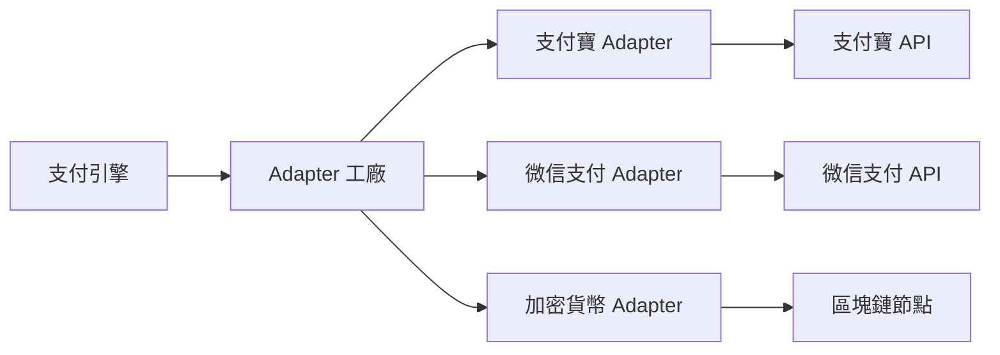

# 通道對接開發指南 (Channel Integration Guide)

## 前言
本指南旨在為開發人員提供標準化的支付通道對接流程。透過採用 **Adapter Pattern (適配器模式)**，我們將不同支付通道的 API 差異封裝在獨立的 Adapter 類別中，並對支付引擎提供統一的介面，實現通道接入的標準化與解耦。

## 1. 通道對接架構說明
支付引擎透過 `AdapterFactory` 獲取對應通道的 `Adapter` 實例，並調用其統一介面。

## 2. 新通道接入步驟 (Step by Step)

### 第一步：準備通道參數
獲取第三方支付通道提供的 API Key、API Secret、Gateway URL、商戶 ID 等必要參數。

### 第二步：建立 Adapter 檔案
在 `services/payment-service/src/adapters/` 目錄下建立新的 Adapter 檔案，例如 `NewChannelAdapter.js`。

### 第三步：繼承 BaseAdapter 並實作介面
繼承 `BaseAdapter` 類別，並實作以下四個核心方法：
1.  `createOrder(orderData)`: 建立支付訂單，獲取支付連結或 QR 碼。
2.  `queryOrder(platformOrderId)`: 查詢訂單狀態。
3.  `refund(refundData)`: 申請退款。
4.  `verifyCallback(rawData)`: 驗證回調簽名並解析資料。

### 第四步：註冊 Adapter
在 `AdapterFactory.js` 的 `getAdapter` 方法中新增對應的 `case` 分支，以便工廠能正確實例化新通道。

### 第五步：通道參數配置
在資料庫或配置檔案中新增該通道的參數配置，包括費率、支援幣種、限額等。

## 3. 統一介面規範

### 3.1 下單 (createOrder)
- **輸入**：包含平台訂單號、金額、幣種、商品描述、回調地址等。
- **輸出**：統一格式的物件，包含 `success`, `payUrl`, `channelOrderId` 等。

### 3.2 查詢 (queryOrder)
- **輸入**：平台訂單號。
- **輸出**：統一格式的物件，包含 `success`, `status` (PAID, PENDING, FAILED, REFUNDED), `amount` 等。

### 3.3 退款 (refund)
- **輸入**：退款單號、原訂單號、退款金額。
- **輸出**：統一格式的物件，包含 `success`, `refundId`, `status` 等。

### 3.4 回調驗簽 (verifyCallback)
- **輸入**：通道傳送的原始 HTTP 請求資料。
- **輸出**：統一格式的物件，包含 `isValid`, `platformOrderId`, `status`, `amount` 等。

## 4. 回調處理標準流程
1.  **接收請求**：支付引擎接收到通道的回調通知。
2.  **調用 Adapter**：調用對應 Adapter 的 `verifyCallback` 方法進行驗簽與解析。
3.  **驗證結果**：若 `isValid` 為 `false`，則記錄異常日誌並返回錯誤給通道。
4.  **更新訂單**：若驗簽通過，則根據解析出的 `status` 更新平台內部訂單狀態。
5.  **通知商戶**：異步發送回調通知給商戶預設的 `notify_url`。
6.  **回應通道**：按照通道要求的格式返回成功回應（如 `success` 或 `OK`）。

## 5. 測試與上線 Checklist
- [ ] 已實作所有 `BaseAdapter` 定義的介面。
- [ ] 簽名算法已通過沙盒環境測試。
- [ ] 支付、查詢、退款流程均已測試成功。
- [ ] 回調驗簽邏輯正確，能處理各種異常場景。
- [ ] 已在 `AdapterFactory` 中註冊。
- [ ] 通道費率與限額配置正確。
- [ ] 已準備好生產環境的 API 憑證。

## 6. 常見問題 (FAQ)
- **Q: 通道返回的金額單位不一致怎麼辦？**
  - A: 在 Adapter 內部進行轉換，統一對外輸出為保留兩位小數的字串或 Decimal。
- **Q: 通道沒有提供查詢介面怎麼辦？**
  - A: 在 `queryOrder` 中返回 `NOT_SUPPORTED` 狀態，並依賴回調通知。
- **Q: 如何處理通道 API 逾時？**
  - A: 在 Adapter 中實作重試機制或返回特定的錯誤碼，由支付引擎決定是否重試。
