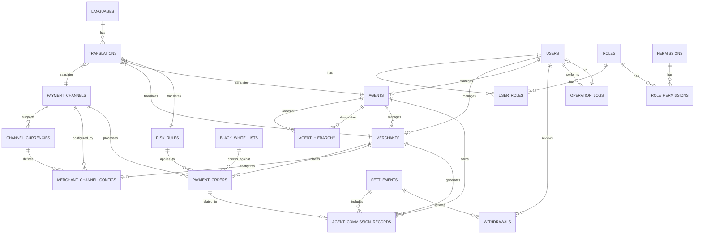

# 聚合支付平台資料庫設計文件

## 前言

本文件旨在詳細說明聚合支付平台的資料庫設計，涵蓋所有核心模組的資料結構、表定義、關聯關係、索引策略以及分區/分表建議。本設計文件將作為開發團隊在資料庫實作、維護及優化時的重要參考依據。

**文件用途**：提供聚合支付平台資料庫的全面設計藍圖，確保資料的一致性、完整性與高效性。

**適用範圍**：本文件適用於聚合支付平台的前端（商戶端）、後台（管理端）、代理管理端以及所有後端服務的開發、測試與維護人員。

**相關模組**：支付引擎、通道管理、代理管理、商戶管理、結算系統、風控模組。

**技術棧**：資料庫採用 **Supabase (PostgreSQL)** + Redis + MongoDB。本文件主要聚焦於 Supabase 提供的 PostgreSQL 關聯式資料庫設計，並整合 Supabase Auth 與 RLS (Row Level Security) 功能。

## 1. 核心需求與多語言支援

### 1.1 核心需求回顧

1.  **聚合支付**：支援多幣種（法幣+加密貨幣）、多支付通道、分幣種結算。一個通道可能支援多種法幣。支援不同法幣跟不同法幣通道。
2.  **代理體系**：多層級代理、分潤 + mark-up 模式、代理可管理下級代理和商戶，擁有管理權。代理可以開通下級代理和商戶。
3.  **使用者介面**：前台（商戶端）、後台（管理端）、代理管理端。

### 1.2 多語言支援

系統需支援多語言，包括繁體中文、簡體中文、英文、日文、韓文、泰文、越南文。資料庫設計將透過專門的語言配置表和翻譯表來實現多語言內容的管理，確保系統介面和部分資料內容能夠根據使用者設定的語言進行顯示。

## 2. 資料庫表結構設計

本節將詳細定義聚合支付平台的核心資料庫表結構，包括欄位名、型別、說明、索引及約束。部分需要多語言支援的欄位將透過 `translations` 表進行關聯。

### 2.1 系統基礎表

#### 2.1.1 `languages` (語言配置表)

用於儲存系統支援的所有語言資訊。

| 欄位名       | 型別      | 說明             | 索引 | 約束       |
| :----------- | :-------- | :--------------- | :--- | :--------- |
| `id`         | `SERIAL`  | 主鍵，自動增長   | PK   | `NOT NULL` |
| `code`       | `VARCHAR(10)` | 語言代碼 (e.g., zh-TW, en-US) | UK   | `NOT NULL` |
| `name`       | `VARCHAR(50)` | 語言名稱 (e.g., 繁體中文, English) |      | `NOT NULL` |
| `is_active`  | `BOOLEAN` | 是否啟用         |      | `DEFAULT TRUE` |
| `created_at` | `TIMESTAMP WITH TIME ZONE` | 建立時間         |      | `DEFAULT CURRENT_TIMESTAMP` |
| `updated_at` | `TIMESTAMP WITH TIME ZONE` | 更新時間         |      | `DEFAULT CURRENT_TIMESTAMP` |

#### 2.1.2 `translations` (多語言翻譯表)

用於儲存系統中需要多語言顯示的內容。透過 `resource_type` 和 `resource_id` 關聯到具體的業務資料，`field_name` 指定需要翻譯的欄位。

| 欄位名         | 型別      | 說明             | 索引 | 約束       |
| :------------- | :-------- | :--------------- | :--- | :--------- |
| `id`           | `SERIAL`  | 主鍵，自動增長   | PK   | `NOT NULL` |
| `language_id`  | `INTEGER` | 語言ID，外鍵關聯 `languages.id` | FK   | `NOT NULL` |
| `resource_type`| `VARCHAR(50)` | 資源類型 (e.g., 'channel', 'risk_rule') |      | `NOT NULL` |
| `resource_id`  | `INTEGER` | 資源ID，關聯到具體業務表的主鍵 |      | `NOT NULL` |
| `field_name`   | `VARCHAR(100)` | 需要翻譯的欄位名稱 (e.g., 'name', 'description') |      | `NOT NULL` |
| `translated_text`| `TEXT`    | 翻譯後的內容     |      | `NOT NULL` |
| `created_at`   | `TIMESTAMP WITH TIME ZONE` | 建立時間         |      | `DEFAULT CURRENT_TIMESTAMP` |
| `updated_at`   | `TIMESTAMP WITH TIME ZONE` | 更新時間         |      | `DEFAULT CURRENT_TIMESTAMP` |

**複合唯一索引**：`language_id`, `resource_type`, `resource_id`, `field_name`

#### 2.1.3 `users` (使用者/帳戶表)

平台所有使用者（管理員、商戶、代理）的基礎資訊。

| 欄位名       | 型別      | 說明             | 索引 | 約束       |
| :----------- | :-------- | :--------------- | :--- | :--------- |
| `id`         | `SERIAL`  | 主鍵，自動增長   | PK   | `NOT NULL` |
| `username`   | `VARCHAR(50)` | 使用者名稱       | UK   | `NOT NULL` |
| `password_hash`| `VARCHAR(255)` | 密碼哈希         |      | `NOT NULL` |
| `email`      | `VARCHAR(100)` | 電子郵件         | UK   | `NOT NULL` |
| `phone_number`| `VARCHAR(20)` | 手機號碼         |      |            |
| `user_type`  | `VARCHAR(20)` | 使用者類型 (admin, merchant, agent) |      | `NOT NULL` |
| `status`     | `VARCHAR(20)` | 帳戶狀態 (active, inactive, suspended) |      | `DEFAULT 'active'` |
| `last_login_at`| `TIMESTAMP WITH TIME ZONE` | 最後登入時間     |      |            |
| `created_at` | `TIMESTAMP WITH TIME ZONE` | 建立時間         |      | `DEFAULT CURRENT_TIMESTAMP` |
| `updated_at` | `TIMESTAMP WITH TIME ZONE` | 更新時間         |      | `DEFAULT CURRENT_TIMESTAMP` |

#### 2.1.4 `roles` (角色表)

定義系統中的角色。

| 欄位名       | 型別      | 說明             | 索引 | 約束       |
| :----------- | :-------- | :--------------- | :--- | :--------- |
| `id`         | `SERIAL`  | 主鍵，自動增長   | PK   | `NOT NULL` |
| `name`       | `VARCHAR(50)` | 角色名稱 (e.g., Super Admin, Merchant Admin) | UK   | `NOT NULL` |
| `description`| `TEXT`    | 角色描述         |      |            |
| `created_at` | `TIMESTAMP WITH TIME ZONE` | 建立時間         |      | `DEFAULT CURRENT_TIMESTAMP` |
| `updated_at` | `TIMESTAMP WITH TIME ZONE` | 更新時間         |      | `DEFAULT CURRENT_TIMESTAMP` |

#### 2.1.5 `permissions` (權限表)

定義系統中的具體操作權限。

| 欄位名       | 型別      | 說明             | 索引 | 約束       |
| :----------- | :-------- | :--------------- | :--- | :--------- |
| `id`         | `SERIAL`  | 主鍵，自動增長   | PK   | `NOT NULL` |
| `name`       | `VARCHAR(100)` | 權限名稱 (e.g., payment:create, merchant:view) | UK   | `NOT NULL` |
| `description`| `TEXT`    | 權限描述         |      |            |
| `created_at` | `TIMESTAMP WITH TIME ZONE` | 建立時間         |      | `DEFAULT CURRENT_TIMESTAMP` |
| `updated_at` | `TIMESTAMP WITH TIME ZONE` | 更新時間         |      | `DEFAULT CURRENT_TIMESTAMP` |

#### 2.1.6 `user_roles` (使用者角色關聯表)

關聯使用者和角色，一個使用者可以有多個角色。

| 欄位名       | 型別      | 說明             | 索引 | 約束       |
| :----------- | :-------- | :--------------- | :--- | :--------- |
| `user_id`    | `INTEGER` | 使用者ID，外鍵關聯 `users.id` | FK   | `NOT NULL` |
| `role_id`    | `INTEGER` | 角色ID，外鍵關聯 `roles.id` | FK   | `NOT NULL` |

**複合主鍵**：`user_id`, `role_id`

#### 2.1.7 `role_permissions` (角色權限關聯表)

關聯角色和權限，一個角色可以有多個權限。

| 欄位名       | 型別      | 說明             | 索引 | 約束       |
| :----------- | :-------- | :--------------- | :--- | :--------- |
| `role_id`    | `INTEGER` | 角色ID，外鍵關聯 `roles.id` | FK   | `NOT NULL` |
| `permission_id`| `INTEGER` | 權限ID，外鍵關聯 `permissions.id` | FK   | `NOT NULL` |

**複合主鍵**：`role_id`, `permission_id`

### 2.2 商戶與代理管理

#### 2.2.1 `merchants` (商戶表)

儲存商戶的詳細資訊。

| 欄位名       | 型別      | 說明             | 索引 | 約束       |
| :----------- | :-------- | :--------------- | :--- | :--------- |
| `id`         | `SERIAL`  | 主鍵，自動增長   | PK   | `NOT NULL` |
| `user_id`    | `INTEGER` | 關聯到 `users` 表的使用者ID | FK   | `NOT NULL` |
| `name`       | `VARCHAR(255)` | 商戶名稱 (需多語言支援) |      | `NOT NULL` |
| `legal_name` | `VARCHAR(255)` | 法人名稱         |      |            |
| `contact_person`| `VARCHAR(100)` | 聯絡人           |      |            |
| `contact_email`| `VARCHAR(100)` | 聯絡電子郵件     |      | `NOT NULL` |
| `phone_number`| `VARCHAR(20)` | 聯絡電話         |      |            |
| `address`    | `TEXT`    | 公司地址         |      |            |
| `website`    | `VARCHAR(255)` | 網站             |      |            |
| `status`     | `VARCHAR(20)` | 商戶狀態 (pending, active, suspended) |      | `DEFAULT 'pending'` |
| `parent_agent_id`| `INTEGER` | 上級代理ID，外鍵關聯 `agents.id` | FK   |            |
| `created_at` | `TIMESTAMP WITH TIME ZONE` | 建立時間         |      | `DEFAULT CURRENT_TIMESTAMP` |
| `updated_at` | `TIMESTAMP WITH TIME ZONE` | 更新時間         |      | `DEFAULT CURRENT_TIMESTAMP` |

**注意**：`name` 欄位需要多語言支援，實際顯示時將透過 `translations` 表獲取。

#### 2.2.2 `agents` (代理表)

儲存代理的詳細資訊。

| 欄位名       | 型別      | 說明             | 索引 | 約束       |
| :----------- | :-------- | :--------------- | :--- | :--------- |
| `id`         | `SERIAL`  | 主鍵，自動增長   | PK   | `NOT NULL` |
| `user_id`    | `INTEGER` | 關聯到 `users` 表的使用者ID | FK   | `NOT NULL` |
| `name`       | `VARCHAR(255)` | 代理名稱 (需多語言支援) |      | `NOT NULL` |
| `contact_person`| `VARCHAR(100)` | 聯絡人           |      |            |
| `contact_email`| `VARCHAR(100)` | 聯絡電子郵件     |      | `NOT NULL` |
| `phone_number`| `VARCHAR(20)` | 聯絡電話         |      |            |
| `status`     | `VARCHAR(20)` | 代理狀態 (pending, active, suspended) |      | `DEFAULT 'pending'` |
| `parent_agent_id`| `INTEGER` | 上級代理ID，外鍵關聯 `agents.id` (自引用) | FK   |            |
| `commission_rate_type`| `VARCHAR(50)` | 分潤模式 (percentage, fixed, markup) |      | `NOT NULL` |
| `base_commission_rate`| `NUMERIC(5,4)` | 基礎分潤比例或固定金額 |      | `DEFAULT 0.0000` |
| `markup_rate`| `NUMERIC(5,4)` | Mark-up 比例     |      | `DEFAULT 0.0000` |
| `created_at` | `TIMESTAMP WITH TIME ZONE` | 建立時間         |      | `DEFAULT CURRENT_TIMESTAMP` |
| `updated_at` | `TIMESTAMP WITH TIME ZONE` | 更新時間         |      | `DEFAULT CURRENT_TIMESTAMP` |

**注意**：`name` 欄位需要多語言支援，實際顯示時將透過 `translations` 表獲取。

#### 2.2.3 `agent_hierarchy` (代理層級關係表)

用於儲存代理之間的層級關係，支援無限層級。此表可以簡化查詢代理鏈路。

| 欄位名       | 型別      | 說明             | 索引 | 約束       |
| :----------- | :-------- | :--------------- | :--- | :--------- |
| `ancestor_id`| `INTEGER` | 祖先代理ID，外鍵關聯 `agents.id` | FK   | `NOT NULL` |
| `descendant_id`| `INTEGER` | 後代代理ID，外鍵關聯 `agents.id` | FK   | `NOT NULL` |
| `depth`      | `INTEGER` | 深度，表示從祖先到後代的層級數 (0 表示自身) |      | `NOT NULL` |

**複合主鍵**：`ancestor_id`, `descendant_id`
**索引**：`descendant_id` (用於快速查詢某代理的所有祖先)

### 2.3 支付通道管理

#### 2.3.1 `payment_channels` (支付通道表)

儲存所有可用的支付通道資訊。

| 欄位名       | 型別      | 說明             | 索引 | 約束       |
| :----------- | :-------- | :--------------- | :--- | :--------- |
| `id`         | `SERIAL`  | 主鍵，自動增長   | PK   | `NOT NULL` |
| `name`       | `VARCHAR(100)` | 通道名稱 (需多語言支援) | UK   | `NOT NULL` |
| `code`       | `VARCHAR(50)` | 通道代碼 (e.g., ALIPAY, WECHAT_PAY, BINANCE_PAY) | UK   | `NOT NULL` |
| `description`| `TEXT`    | 通道描述 (需多語言支援) |      |            |
| `type`       | `VARCHAR(50)` | 通道類型 (e.g., fiat, crypto) |      | `NOT NULL` |
| `status`     | `VARCHAR(20)` | 通道狀態 (active, inactive, maintenance) |      | `DEFAULT 'active'` |
| `config_json`| `JSONB`   | 通道配置參數 (e.g., API keys, endpoints) |      |            |
| `created_at` | `TIMESTAMP WITH TIME ZONE` | 建立時間         |      | `DEFAULT CURRENT_TIMESTAMP` |
| `updated_at` | `TIMESTAMP WITH TIME ZONE` | 更新時間         |      | `DEFAULT CURRENT_TIMESTAMP` |

**注意**：`name` 和 `description` 欄位需要多語言支援，實際顯示時將透過 `translations` 表獲取。

#### 2.3.2 `channel_currencies` (通道幣種配置表)

定義每個支付通道支援的幣種及其相關配置（如費率、限額）。

| 欄位名       | 型別      | 說明             | 索引 | 約束       |
| :----------- | :-------- | :--------------- | :--- | :--------- |
| `id`         | `SERIAL`  | 主鍵，自動增長   | PK   | `NOT NULL` |
| `channel_id` | `INTEGER` | 支付通道ID，外鍵關聯 `payment_channels.id` | FK   | `NOT NULL` |
| `currency_code`| `VARCHAR(10)` | 幣種代碼 (e.g., USD, TWD, BTC, USDT) |      | `NOT NULL` |
| `currency_type`| `VARCHAR(20)` | 幣種類型 (fiat, crypto) |      | `NOT NULL` |
| `min_amount` | `NUMERIC(18,8)` | 單筆最小交易金額 |      | `DEFAULT 0.00` |
| `max_amount` | `NUMERIC(18,8)` | 單筆最大交易金額 |      | `DEFAULT 999999999.99` |
| `fee_rate`   | `NUMERIC(5,4)` | 基礎手續費率     |      | `DEFAULT 0.00` |
| `fixed_fee`  | `NUMERIC(18,8)` | 固定手續費       |      | `DEFAULT 0.00` |
| `status`     | `VARCHAR(20)` | 幣種配置狀態 (active, inactive) |      | `DEFAULT 'active'` |
| `created_at` | `TIMESTAMP WITH TIME ZONE` | 建立時間         |      | `DEFAULT CURRENT_TIMESTAMP` |
| `updated_at` | `TIMESTAMP WITH TIME ZONE` | 更新時間         |      | `DEFAULT CURRENT_TIMESTAMP` |

**複合唯一索引**：`channel_id`, `currency_code`

#### 2.3.3 `merchant_channel_configs` (商戶通道配置表)

儲存商戶對特定支付通道的客製化配置，包括費率、啟用狀態等。

| 欄位名       | 型別      | 說明             | 索引 | 約束       |
| :----------- | :-------- | :--------------- | :--- | :--------- |\n| `id`         | `SERIAL`  | 主鍵，自動增長   | PK   | `NOT NULL` |
| `merchant_id`| `INTEGER` | 商戶ID，外鍵關聯 `merchants.id` | FK   | `NOT NULL` |
| `channel_id` | `INTEGER` | 支付通道ID，外鍵關聯 `payment_channels.id` | FK   | `NOT NULL` |
| `currency_code`| `VARCHAR(10)` | 幣種代碼 (e.g., USD, TWD, BTC, USDT) |      | `NOT NULL` |
| `is_enabled` | `BOOLEAN` | 商戶是否啟用此通道此幣種 |      | `DEFAULT TRUE` |
| `fee_rate`   | `NUMERIC(5,4)` | 商戶客製化手續費率 |      |            |
| `fixed_fee`  | `NUMERIC(18,8)` | 商戶客製化固定手續費 |      |            |
| `min_amount` | `NUMERIC(18,8)` | 商戶單筆最小交易金額 |      |            |
| `max_amount` | `NUMERIC(18,8)` | 商戶單筆最大交易金額 |      |            |
| `created_at` | `TIMESTAMP WITH TIME ZONE` | 建立時間         |      | `DEFAULT CURRENT_TIMESTAMP` |
| `updated_at` | `TIMESTAMP WITH TIME ZONE` | 更新時間         |      | `DEFAULT CURRENT_TIMESTAMP` |

**複合唯一索引**：`merchant_id`, `channel_id`, `currency_code`

### 2.4 支付與結算

#### 2.4.1 `payment_orders` (支付訂單表)

儲存所有支付交易的詳細資訊。

| 欄位名       | 型別      | 說明             | 索引 | 約束       |
| :----------- | :-------- | :--------------- | :--- | :--------- |
| `id`         | `SERIAL`  | 主鍵，自動增長   | PK   | `NOT NULL` |
| `order_sn`   | `VARCHAR(64)` | 平台訂單號，唯一識別 | UK   | `NOT NULL` |
| `merchant_id`| `INTEGER` | 商戶ID，外鍵關聯 `merchants.id` | FK   | `NOT NULL` |
| `merchant_order_id`| `VARCHAR(64)` | 商戶訂單號       |      | `NOT NULL` |
| `channel_id` | `INTEGER` | 實際使用的支付通道ID | FK   | `NOT NULL` |
| `currency_code`| `VARCHAR(10)` | 交易幣種代碼     |      | `NOT NULL` |
| `amount`     | `NUMERIC(18,8)` | 交易金額         |      | `NOT NULL` |
| `actual_amount`| `NUMERIC(18,8)` | 實際支付金額 (可能因匯率或手續費不同) |      |            |
| `fee`        | `NUMERIC(18,8)` | 平台收取手續費   |      | `DEFAULT 0.00` |
| `status`     | `VARCHAR(20)` | 訂單狀態 (pending, success, failed, refunded) |      | `DEFAULT 'pending'` |
| `payment_method`| `VARCHAR(50)` | 支付方式 (e.g., credit_card, bank_transfer) |      |            |
| `channel_transaction_id`| `VARCHAR(100)` | 支付通道交易ID   |      |            |
| `callback_url`| `TEXT`    | 商戶回調URL      |      |            |
| `notify_status`| `VARCHAR(20)` | 回調通知狀態 (pending, success, failed) |      | `DEFAULT 'pending'` |
| `risk_score` | `INTEGER` | 風控評分         |      | `DEFAULT 0` |
| `risk_decision`| `VARCHAR(50)` | 風控決策 (pass, review, reject) |      | `DEFAULT 'pass'` |
| `created_at` | `TIMESTAMP WITH TIME ZONE` | 建立時間         |      | `DEFAULT CURRENT_TIMESTAMP` |
| `updated_at` | `TIMESTAMP WITH TIME ZONE` | 更新時間         |      | `DEFAULT CURRENT_TIMESTAMP` |
| `completed_at`| `TIMESTAMP WITH TIME ZONE` | 完成時間         |      |            |

**索引**：`merchant_id`, `order_sn`, `channel_id`, `status`, `created_at`

#### 2.4.2 `settlements` (結算表)

儲存商戶和代理的結算記錄，分幣種結算。

| 欄位名       | 型別      | 說明             | 索引 | 約束       |
| :----------- | :-------- | :--------------- | :--- | :--------- |
| `id`         | `SERIAL`  | 主鍵，自動增長   | PK   | `NOT NULL` |
| `settlement_sn`| `VARCHAR(64)` | 結算單號，唯一識別 | UK   | `NOT NULL` |
| `entity_type`| `VARCHAR(20)` | 結算實體類型 (merchant, agent) |      | `NOT NULL` |
| `entity_id`  | `INTEGER` | 結算實體ID (merchant_id 或 agent_id) | FK   | `NOT NULL` |
| `currency_code`| `VARCHAR(10)` | 結算幣種代碼     |      | `NOT NULL` |
| `start_date` | `DATE`    | 結算週期開始日期 |      | `NOT NULL` |
| `end_date`   | `DATE`    | 結算週期結束日期 |      | `NOT NULL` |
| `total_income`| `NUMERIC(18,8)` | 總收入           |      | `DEFAULT 0.00` |
| `total_fee`  | `NUMERIC(18,8)` | 總手續費         |      | `DEFAULT 0.00` |
| `total_refund`| `NUMERIC(18,8)` | 總退款金額       |      | `DEFAULT 0.00` |
| `net_amount` | `NUMERIC(18,8)` | 淨結算金額       |      | `DEFAULT 0.00` |
| `status`     | `VARCHAR(20)` | 結算狀態 (pending, processing, completed, failed) |      | `DEFAULT 'pending'` |
| `settled_at` | `TIMESTAMP WITH TIME ZONE` | 結算完成時間     |      |            |
| `created_at` | `TIMESTAMP WITH TIME ZONE` | 建立時間         |      | `DEFAULT CURRENT_TIMESTAMP` |
| `updated_at` | `TIMESTAMP WITH TIME ZONE` | 更新時間         |      | `DEFAULT CURRENT_TIMESTAMP` |

**索引**：`entity_type`, `entity_id`, `currency_code`, `status`, `start_date`, `end_date`

#### 2.4.3 `agent_commission_records` (代理分潤記錄表)

儲存每筆交易產生的代理分潤明細。

| 欄位名       | 型別      | 說明             | 索引 | 約束       |
| :----------- | :-------- | :--------------- | :--- | :--------- |
| `id`         | `SERIAL`  | 主鍵，自動增長   | PK   | `NOT NULL` |
| `order_id`   | `INTEGER` | 支付訂單ID，外鍵關聯 `payment_orders.id` | FK   | `NOT NULL` |
| `agent_id`   | `INTEGER` | 代理ID，外鍵關聯 `agents.id` | FK   | `NOT NULL` |
| `merchant_id`| `INTEGER` | 商戶ID，外鍵關聯 `merchants.id` | FK   | `NOT NULL` |
| `currency_code`| `VARCHAR(10)` | 分潤幣種代碼     |      | `NOT NULL` |
| `commission_amount`| `NUMERIC(18,8)` | 分潤金額         |      | `NOT NULL` |
| `commission_rate`| `NUMERIC(5,4)` | 實際分潤比例     |      |            |
| `commission_type`| `VARCHAR(50)` | 分潤類型 (percentage, fixed, markup) |      | `NOT NULL` |
| `status`     | `VARCHAR(20)` | 分潤狀態 (pending, settled) |      | `DEFAULT 'pending'` |
| `settlement_id`| `INTEGER` | 關聯的結算單ID，外鍵關聯 `settlements.id` | FK   |            |
| `created_at` | `TIMESTAMP WITH TIME ZONE` | 建立時間         |      | `DEFAULT CURRENT_TIMESTAMP` |
| `updated_at` | `TIMESTAMP WITH TIME ZONE` | 更新時間         |      | `DEFAULT CURRENT_TIMESTAMP` |

**索引**：`order_id`, `agent_id`, `merchant_id`, `status`, `created_at`

#### 2.4.4 `withdrawals` (提現記錄表)

儲存商戶或代理的提現申請記錄。

| 欄位名       | 型別      | 說明             | 索引 | 約束       |
| :----------- | :-------- | :--------------- | :--- | :--------- |
| `id`         | `SERIAL`  | 主鍵，自動增長   | PK   | `NOT NULL` |
| `withdrawal_sn`| `VARCHAR(64)` | 提現單號，唯一識別 | UK   | `NOT NULL` |
| `entity_type`| `VARCHAR(20)` | 提現實體類型 (merchant, agent) |      | `NOT NULL` |
| `entity_id`  | `INTEGER` | 提現實體ID (merchant_id 或 agent_id) | FK   | `NOT NULL` |
| `currency_code`| `VARCHAR(10)` | 提現幣種代碼     |      | `NOT NULL` |
| `amount`     | `NUMERIC(18,8)` | 提現金額         |      | `NOT NULL` |
| `fee`        | `NUMERIC(18,8)` | 提現手續費       |      | `DEFAULT 0.00` |
| `actual_amount`| `NUMERIC(18,8)` | 實際到帳金額     |      | `NOT NULL` |
| `bank_name`  | `VARCHAR(100)` | 銀行名稱         |      |            |
| `account_name`| `VARCHAR(100)` | 帳戶名稱         |      |            |
| `account_number`| `VARCHAR(100)` | 銀行帳號         |      |            |
| `crypto_wallet_address`| `VARCHAR(255)` | 加密貨幣錢包地址 |      |            |
| `status`     | `VARCHAR(20)` | 提現狀態 (pending, processing, success, failed) |      | `DEFAULT 'pending'` |
| `reviewed_by`| `INTEGER` | 審核人ID，外鍵關聯 `users.id` | FK   |            |
| `reviewed_at`| `TIMESTAMP WITH TIME ZONE` | 審核時間         |      |            |
| `created_at` | `TIMESTAMP WITH TIME ZONE` | 建立時間         |      | `DEFAULT CURRENT_TIMESTAMP` |
| `updated_at` | `TIMESTAMP WITH TIME ZONE` | 更新時間         |      | `DEFAULT CURRENT_TIMESTAMP` |

**索引**：`entity_type`, `entity_id`, `currency_code`, `status`, `created_at`

### 2.5 風控管理

#### 2.5.1 `risk_rules` (風控規則表)

儲存風控模組使用的規則配置。

| 欄位名       | 型別      | 說明             | 索引 | 約束       |
| :----------- | :-------- | :--------------- | :--- | :--------- |
| `id`         | `SERIAL`  | 主鍵，自動增長   | PK   | `NOT NULL` |
| `name`       | `VARCHAR(100)` | 規則名稱 (需多語言支援) | UK   | `NOT NULL` |
| `description`| `TEXT`    | 規則描述 (需多語言支援) |      |            |
| `rule_type`  | `VARCHAR(50)` | 規則類型 (e.g., amount_limit, ip_blacklist, frequency) |      | `NOT NULL` |
| `rule_config`| `JSONB`   | 規則具體配置 (e.g., {'min_amount': 1000, 'max_amount': 10000}) |      |            |
| `priority`   | `INTEGER` | 規則執行優先級   |      | `DEFAULT 0` |
| `action`     | `VARCHAR(50)` | 觸發規則後的動作 (pass, review, reject) |      | `NOT NULL` |
| `is_active`  | `BOOLEAN` | 是否啟用         |      | `DEFAULT TRUE` |
| `created_at` | `TIMESTAMP WITH TIME ZONE` | 建立時間         |      | `DEFAULT CURRENT_TIMESTAMP` |
| `updated_at` | `TIMESTAMP WITH TIME ZONE` | 更新時間         |      | `DEFAULT CURRENT_TIMESTAMP` |

**注意**：`name` 和 `description` 欄位需要多語言支援，實際顯示時將透過 `translations` 表獲取。

#### 2.5.2 `black_white_lists` (黑白名單表)

儲存用於風控的黑名單和白名單資訊。

| 欄位名       | 型別      | 說明             | 索引 | 約束       |
| :----------- | :-------- | :--------------- | :--- | :--------- |
| `id`         | `SERIAL`  | 主鍵，自動增長   | PK   | `NOT NULL` |
| `list_type`  | `VARCHAR(10)` | 名單類型 (black, white) |      | `NOT NULL` |
| `entry_type` | `VARCHAR(50)` | 條目類型 (ip, user_id, email, card_number) |      | `NOT NULL` |
| `entry_value`| `VARCHAR(255)` | 條目值           |      | `NOT NULL` |
| `reason`     | `TEXT`    | 加入名單的原因   |      |            |
| `expires_at` | `TIMESTAMP WITH TIME ZONE` | 過期時間         |      |            |
| `created_at` | `TIMESTAMP WITH TIME ZONE` | 建立時間         |      | `DEFAULT CURRENT_TIMESTAMP` |
| `updated_at` | `TIMESTAMP WITH TIME ZONE` | 更新時間         |      | `DEFAULT CURRENT_TIMESTAMP` |

**複合唯一索引**：`list_type`, `entry_type`, `entry_value`

### 2.6 操作日誌

#### 2.6.1 `operation_logs` (操作日誌表)

記錄系統中的關鍵操作，用於審計和追溯。

| 欄位名       | 型別      | 說明             | 索引 | 約束       |
| :----------- | :-------- | :--------------- | :--- | :--------- |
| `id`         | `SERIAL`  | 主鍵，自動增長   | PK   | `NOT NULL` |
| `user_id`    | `INTEGER` | 操作使用者ID，外鍵關聯 `users.id` | FK   |            |
| `user_type`  | `VARCHAR(20)` | 操作使用者類型 (admin, merchant, agent) |      |            |
| `action`     | `VARCHAR(100)` | 操作行為 (e.g., login, create_merchant, update_channel) |      | `NOT NULL` |
| `resource_type`| `VARCHAR(50)` | 操作資源類型     |      |            |
| `resource_id`| `INTEGER` | 操作資源ID       |      |            |
| `details`    | `JSONB`   | 操作詳情 (e.g., 變更前後的資料) |      |            |
| `ip_address` | `VARCHAR(45)` | 操作IP地址       |      |            |
| `created_at` | `TIMESTAMP WITH TIME ZONE` | 建立時間         |      | `DEFAULT CURRENT_TIMESTAMP` |

**索引**：`user_id`, `action`, `resource_type`, `created_at`

## 3. 表之間的關聯關係

以下是核心表之間的關聯關係概述：

*   `users` (1) --- (1) `merchants` (商戶有對應的使用者帳戶)
*   `users` (1) --- (1) `agents` (代理有對應的使用者帳戶)
*   `users` (1) --- (N) `user_roles` (一個使用者可以有多個角色)
*   `roles` (1) --- (N) `user_roles` (一個角色可以被多個使用者擁有)
*   `roles` (1) --- (N) `role_permissions` (一個角色可以有多個權限)
*   `permissions` (1) --- (N) `role_permissions` (一個權限可以被多個角色擁有)
*   `agents` (1) --- (N) `agents` (自引用，表示上級代理與下級代理的關係)
*   `agents` (1) --- (N) `merchants` (一個代理可以管理多個商戶)
*   `agents` (1) --- (N) `agent_hierarchy` (祖先代理)
*   `agents` (1) --- (N) `agent_hierarchy` (後代代理)
*   `payment_channels` (1) --- (N) `channel_currencies` (一個通道支援多種幣種)
*   `payment_channels` (1) --- (N) `merchant_channel_configs` (商戶對通道的客製化配置)
*   `merchants` (1) --- (N) `merchant_channel_configs` (一個商戶可以有多個通道配置)
*   `merchants` (1) --- (N) `payment_orders` (一個商戶可以有多個支付訂單)
*   `payment_channels` (1) --- (N) `payment_orders` (一個通道可以處理多個支付訂單)
*   `payment_orders` (1) --- (N) `agent_commission_records` (一筆訂單可能產生多筆分潤記錄)
*   `agents` (1) --- (N) `agent_commission_records` (一個代理可以有多筆分潤記錄)
*   `merchants` (1) --- (N) `agent_commission_records` (一筆分潤記錄關聯到一個商戶)
*   `settlements` (1) --- (N) `agent_commission_records` (一個結算單可以包含多筆分潤記錄)
*   `settlements` (1) --- (N) `withdrawals` (一個結算單可能導致提現)
*   `users` (1) --- (N) `withdrawals` (審核人)
*   `users` (1) --- (N) `operation_logs` (操作者)
*   `languages` (1) --- (N) `translations` (一種語言有多條翻譯)
*   `translations` (N) --- (1) `payment_channels` (通道名稱、描述)
*   `translations` (N) --- (1) `merchants` (商戶名稱)
*   `translations` (N) --- (1) `agents` (代理名稱)
*   `translations` (N) --- (1) `risk_rules` (風控規則名稱、描述)

## 4. 實體關係圖 (ER Diagram)



## 5. 索引策略

良好的索引策略對於資料庫的查詢性能至關重要。以下是針對核心表的索引建議：

1.  **主鍵 (Primary Key)**：所有表的主鍵都會自動建立唯一索引，用於快速查詢單條記錄。
2.  **外鍵 (Foreign Key)**：所有外鍵欄位都應建立索引，以加速表之間的 JOIN 操作，特別是在查詢關聯資料時。
3.  **唯一約束 (Unique Constraint)**：具有唯一約束的欄位（如 `users.username`, `users.email`, `payment_channels.code`）會自動建立唯一索引。
4.  **常用查詢條件**：
    *   **時間範圍查詢**：`created_at`, `updated_at`, `start_date`, `end_date` 等時間戳或日期欄位，在進行時間範圍查詢時應建立索引。例如 `payment_orders.created_at`。
    *   **狀態過濾**：`status` 欄位在進行狀態過濾時應建立索引。例如 `payment_orders.status`, `merchants.status`。
    *   **業務識別碼**：`order_sn`, `settlement_sn`, `withdrawal_sn` 等業務單號欄位應建立唯一索引或普通索引，用於快速定位特定業務記錄。
    *   **關聯查詢**：`merchant_id`, `agent_id`, `channel_id` 等用於關聯其他表的欄位應建立索引。
5.  **複合索引**：對於經常一起出現在 `WHERE` 子句中的多個欄位，考慮建立複合索引。例如 `channel_currencies` 表的 `(channel_id, currency_code)`，`translations` 表的 `(language_id, resource_type, resource_id, field_name)`。
6.  **部分索引 (Partial Index)**：對於某些狀態值佔比很小的欄位，可以考慮建立部分索引，只索引特定狀態的記錄，減少索引大小，提高查詢效率。例如，只索引 `payment_orders` 表中 `status = 'pending'` 的訂單。
7.  **Gin/Gist 索引**：對於 `JSONB` 欄位，如果需要對其內部結構進行查詢，應考慮建立 Gin 或 Gist 索引。例如 `payment_channels.config_json`。

**具體索引建議（除PK/UK/FK自動建立外）**：

*   `payment_orders`: `(merchant_id, created_at)`, `(status, created_at)`
*   `settlements`: `(entity_type, entity_id, status, created_at)`
*   `agent_commission_records`: `(agent_id, created_at)`, `(merchant_id, created_at)`
*   `withdrawals`: `(entity_type, entity_id, status, created_at)`
*   `operation_logs`: `(user_id, created_at)`, `(action, created_at)`
*   `translations`: `(resource_type, resource_id)` (用於查詢某資源的所有翻譯)

## 6. 分區/分表策略建議

隨著業務量的增長，單一資料庫表可能會面臨性能瓶頸。針對聚合支付平台的大量交易數據，建議採用分區 (Partitioning) 或分表 (Sharding) 策略。

### 6.1 分區 (Partitioning)

PostgreSQL 支援聲明式分區 (Declarative Partitioning)，可以將大表邏輯上劃分為多個更小的物理儲存單元，提高查詢效率和管理便利性。建議對以下表進行分區：

1.  **`payment_orders` (支付訂單表)**：
    *   **分區鍵**：`created_at` (按時間範圍分區)。
    *   **策略**：按月或按季度進行範圍分區。例如，每月建立一個新的分區表。
    *   **優勢**：歷史訂單查詢性能高，舊資料歸檔或刪除方便，新資料寫入衝突少。

2.  **`agent_commission_records` (代理分潤記錄表)**：
    *   **分區鍵**：`created_at` (按時間範圍分區)。
    *   **策略**：與 `payment_orders` 類似，按月或按季度分區。
    *   **優勢**：分潤查詢和統計效率高。

3.  **`settlements` (結算表)**：
    *   **分區鍵**：`created_at` 或 `settled_at` (按時間範圍分區)。
    *   **策略**：按月或按年分區，便於結算歷史查詢。

4.  **`operation_logs` (操作日誌表)**：
    *   **分區鍵**：`created_at` (按時間範圍分區)。
    *   **策略**：按月或按年分區，便於日誌查詢和定期清理。

### 6.2 分表 (Sharding)

當單一資料庫伺服器無法滿足性能或儲存需求時，可以考慮分表，將資料分散到多個資料庫實例上。這通常需要應用層的支援。

1.  **`payment_orders` (支付訂單表)**：
    *   **分表鍵**：`merchant_id` 或 `order_sn` 的哈希值。
    *   **策略**：根據商戶ID進行哈希分表，將不同商戶的訂單分散到不同的資料庫實例。或者根據訂單號的哈希值進行分表，實現更均勻的資料分佈。
    *   **優勢**：解決單表容量瓶頸，提高併發處理能力。但跨商戶查詢會變得複雜。

2.  **`merchants` (商戶表)**：
    *   **分表鍵**：`id` 或 `created_at`。
    *   **策略**：如果商戶數量巨大，可以考慮對商戶表進行分表，但通常商戶表數據量相對較小，優先考慮垂直分表或讀寫分離。

**分區與分表選擇原則**：

*   **優先考慮分區**：對於單一資料庫實例內的性能優化，優先使用 PostgreSQL 內建的分區功能，它對應用層透明，管理成本較低。
*   **考慮分表**：當單一資料庫實例的硬體資源（CPU、記憶體、IO）達到瓶頸，且分區已無法滿足需求時，再考慮引入分表（Sharding）方案。分表會增加系統的複雜性，需要應用層的改造和額外的中間件支援。

## 7. MongoDB 與 Redis 的應用

除了 PostgreSQL 作為主要關聯式資料庫外，平台還將利用 MongoDB 和 Redis 來處理特定類型的資料和需求。

### 7.1 MongoDB 的應用

MongoDB 作為文件型資料庫，適合儲存非結構化或半結構化資料，以及需要高擴展性的場景。

*   **日誌儲存**：`operation_logs` 表的詳細 `details` 欄位，或者更詳細的原始交易日誌、系統日誌等，可以考慮儲存在 MongoDB 中，便於靈活查詢和擴展。
*   **風控事件與快照**：風控模組產生的複雜事件數據、風險評估的原始輸入數據快照等，可以儲存在 MongoDB 中，便於快速寫入和查詢。
*   **使用者行為數據**：前端使用者行為、點擊流等數據，可用於分析和個性化推薦，適合儲存在 MongoDB。

### 7.2 Redis 的應用

Redis 作為記憶體資料庫，提供極高的讀寫性能，適合用於快取、會話管理、計數器和即時數據。

*   **快取 (Caching)**：
    *   **支付通道配置**：`payment_channels` 和 `channel_currencies` 的配置資訊，可以快取在 Redis 中，減少資料庫查詢。
    *   **商戶配置**：`merchant_channel_configs` 等商戶相關配置。
    *   **匯率資訊**：多幣種交易所需的即時匯率。
    *   **權限快取**：使用者角色和權限資訊，減少每次請求的權限檢查開銷。
*   **會話管理 (Session Management)**：儲存使用者登入會話資訊。
*   **計數器與限流**：用於風控模組的交易頻率統計、限流計數器等。
*   **訊息佇列**：作為輕量級訊息佇列，用於異步處理某些任務，例如支付回調通知的重試佇列。
*   **黑白名單**：將常用的黑白名單數據快取在 Redis 中，實現毫秒級的查詢速度。

## 8. 總結

本資料庫設計文件詳細闡述了聚合支付平台的核心資料庫結構，涵蓋了使用者、商戶、代理、支付通道、訂單、結算、風控以及多語言支援等關鍵業務領域。透過合理的表設計、關聯關係、索引策略和分區/分表建議，旨在構建一個高效、可擴展且易於維護的資料庫系統，為聚合支付平台的穩定運行提供堅實的基礎。同時，結合 MongoDB 和 Redis 的應用，將進一步提升系統在非結構化數據處理和高併發快取方面的能力。

---

**參考資料**

[1]: PostgreSQL Documentation: [https://www.postgresql.org/docs/](https://www.postgresql.org/docs/)
[2]: Mermaid Documentation: [https://mermaid.js.org/](https://mermaid.js.org/)
[3]: MongoDB Documentation: [https://www.mongodb.com/docs/](https://www.mongodb.com/docs/)
[4]: Redis Documentation: [https://redis.io/docs/](https://redis.io/docs/)


## 3. Supabase Auth 與 RLS 策略

### 3.1 Supabase Auth 整合

平台將利用 Supabase Auth 作為主要的身份驗證服務。Supabase Auth 提供了開箱即用的使用者管理功能，包括電子郵件/密碼登入、OAuth 整合等。使用者成功登入後，Supabase 會發放一個 JSON Web Token (JWT)，此 JWT 將包含使用者的 `uuid` 和 `role` 等資訊。後端服務在接收到前端請求時，會驗證此 JWT 的有效性，並從中提取使用者資訊，用於後續的業務邏輯處理和資料庫權限控制。

**整合要點**：
*   **使用者表映射**：Supabase Auth 預設的 `auth.users` 表將作為平台所有使用者（管理員、代理、商戶）的基礎身份資訊來源。平台自身的 `users` 表（`public.users`）將透過 `uuid` 欄位與 `auth.users.id` 進行關聯，以儲存額外的業務相關資訊。
*   **JWT 傳遞**：前端應用在發送 API 請求時，需在 `Authorization` 頭部攜帶 Supabase Auth 返回的 JWT。
*   **後端驗證**：各微服務將使用 Supabase Client SDK 提供的功能，自動驗證 JWT 的有效性，並從中解析出使用者資訊。

### 3.2 Row Level Security (RLS) 策略

Supabase 的核心優勢之一是其基於 PostgreSQL 的 Row Level Security (RLS) 功能。RLS 允許在資料庫層面定義精細的資料存取策略，確保使用者只能看到和操作他們有權限的資料行。結合 Supabase Auth 提供的 JWT，我們可以實現強大的、基於角色的資料存取控制。

**RLS 實作原則**：
*   **預設拒絕**：對於所有敏感資料表，預設啟用 RLS 並設定為拒絕所有存取，除非有明確的策略允許。
*   **基於 JWT 的策略**：RLS 策略將利用 `auth.jwt()` 函數從 JWT 中提取使用者資訊（如 `uid`、`role`），並據此判斷資料存取權限。
*   **角色區分**：為不同的使用者角色（`anon`、`authenticated`、`service_role`、`admin`、`agent`、`merchant`）定義不同的 RLS 策略。
    *   `anon` 角色：用於未經身份驗證的公開存取，權限極低。
    *   `authenticated` 角色：用於已登入的使用者，根據其 `uuid` 和 `role` 進行資料存取。
    *   `service_role` 角色：Supabase 提供的超級使用者角色，擁有所有權限，僅限後端服務在特定情況下使用，需嚴格保護其金鑰。
*   **策略範例**：
    *   **商戶資料存取**：商戶只能存取其自己的交易記錄、配置資訊等。RLS 策略將檢查 `merchant_id` 欄位是否與當前登入使用者的 `uuid` 相關聯。
    *   **代理資料存取**：代理商可以存取其自己的資訊，以及其下級代理和商戶的相關數據。RLS 策略將涉及檢查代理層級關係表。
    *   **管理員資料存取**：管理員擁有最高權限，可以存取所有資料，但仍建議透過 RLS 限制其對敏感操作的直接資料庫存取，鼓勵透過後台管理介面進行操作。

**RLS 策略定義範例 (PostgreSQL)**：

```sql
-- 啟用 RLS
ALTER TABLE public.merchants ENABLE ROW LEVEL SECURITY;

-- 創建策略：允許已認證使用者查看自己的商戶資料
CREATE POLICY "Merchants can view their own data" ON public.merchants
  FOR SELECT USING (auth.uid() = user_id);

-- 創建策略：允許已認證使用者更新自己的商戶資料
CREATE POLICY "Merchants can update their own data" ON public.merchants
  FOR UPDATE USING (auth.uid() = user_id) WITH CHECK (auth.uid() = user_id);

-- 創建策略：允許管理員查看所有商戶資料 (假設 admin 角色)
CREATE POLICY "Admins can view all merchants" ON public.merchants
  FOR SELECT TO authenticated USING (auth.role() = 'admin');

-- 創建策略：允許代理商查看其下級商戶資料 (需要更複雜的 JOIN 查詢)
CREATE POLICY "Agents can view their subordinate merchants" ON public.merchants
  FOR SELECT TO authenticated USING (
    EXISTS (SELECT 1 FROM public.agent_hierarchy ah WHERE ah.ancestor_id = (SELECT id FROM public.agents WHERE user_id = auth.uid()) AND ah.descendant_id = public.merchants.parent_agent_id)
  );
```
