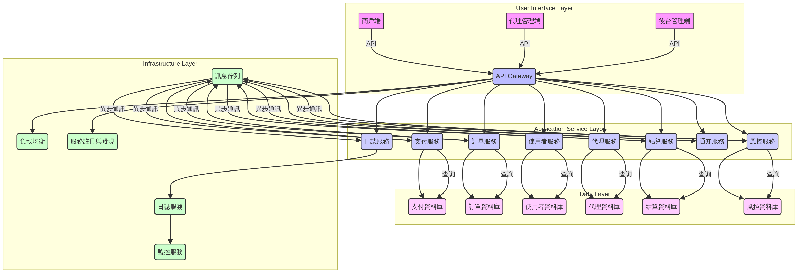
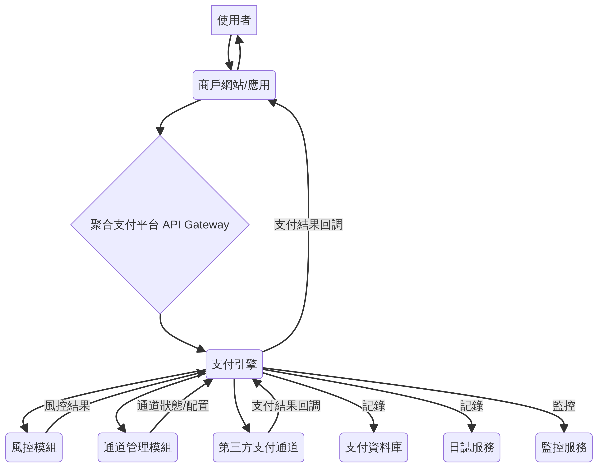
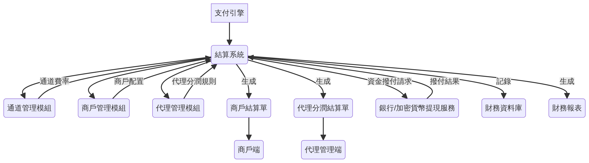
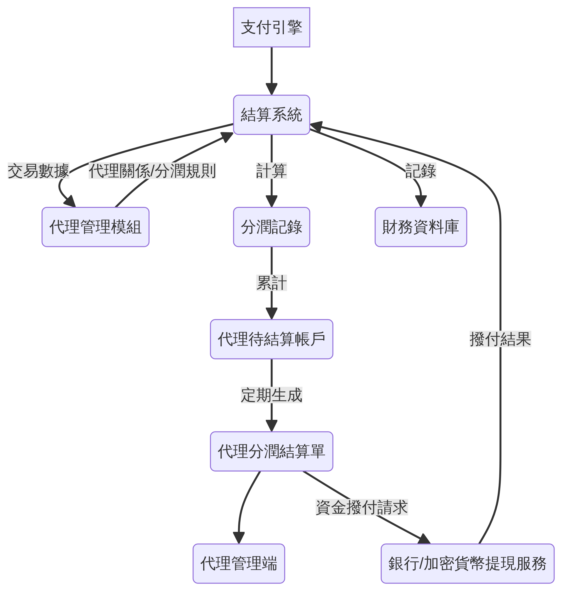
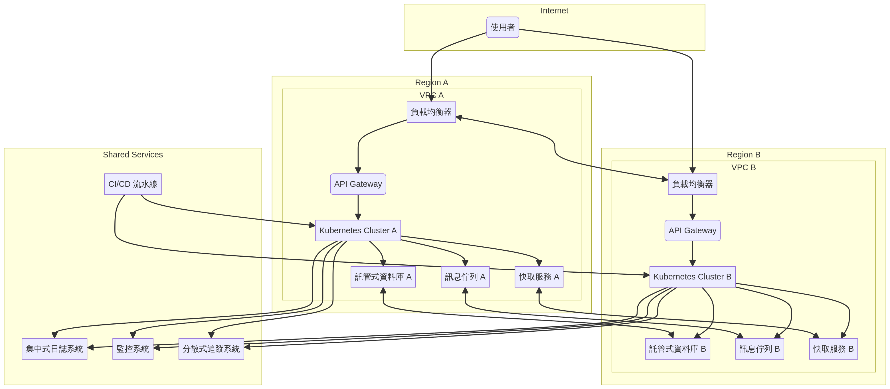

# 聚合支付平台系統架構設計文件

## 1. 引言

本文件旨在詳細闡述聚合支付平台的系統架構設計，為開發、測試、部署及維護提供全面的技術指導。本平台致力於提供一個高效、安全、穩定且具備高度擴展性的支付解決方案，以滿足不同商戶和代理商的業務需求。

**文件用途**：
*   作為系統開發的藍圖，指導各模組的設計與實作。
*   提供技術團隊對系統整體架構的理解，促進跨團隊協作。
*   作為系統維護和升級的參考依據。

**適用範圍**：
本文件適用於聚合支付平台的所有相關技術人員，包括架構師、開發工程師、測試工程師、維運工程師及專案管理人員。

**相關模組說明**：
本系統主要由使用者介面層、應用服務層、資料層和基礎設施層構成，並包含支付引擎、通道管理、代理管理、商戶管理、結算系統及風控模組等核心功能模組。

## 2. 系統整體架構描述

聚合支付平台旨在提供一個全面、高效且安全的支付解決方案，支援多幣種、多支付通道及複雜的代理分潤機制。系統整體架構將採用微服務（Microservices）設計理念，以提高系統的彈性、可擴展性和可維護性。主要由以下幾個部分組成：

1.  **使用者介面層 (User Interface Layer)**：
    *   **商戶端 (Merchant Portal)**：供商戶管理其支付訂單、查看交易記錄、配置支付通道等。
    *   **代理管理端 (Agent Portal)**：供代理商管理其下級代理、商戶、查看分潤報告及配置相關策略。
    *   **後台管理端 (Admin Portal)**：供平台營運人員進行系統配置、使用者管理、風險監控、結算審核等操作。

2.  **應用服務層 (Application Service Layer)**：
    *   由一系列獨立部署的微服務組成，每個服務負責特定的業務功能，例如支付服務、訂單服務、使用者服務、代理服務、結算服務、風控服務等。這些服務之間透過輕量級通訊機制（如 RESTful API 或訊息佇列）進行互動。

3.  **資料層 (Data Layer)**：
    *   每個微服務擁有獨立的資料庫，確保資料的自治性。根據資料特性，可選用關聯式資料庫（如 MySQL）或非關聯式資料庫（如 MongoDB、Redis）。

4.  **基礎設施層 (Infrastructure Layer)**：
    *   包含負載均衡、API Gateway、服務註冊與發現、日誌服務、監控服務等，為上層應用提供穩定可靠的運行環境。

以下為系統整體架構圖：

## 3. 核心模組說明

本聚合支付平台的核心功能將由以下關鍵模組提供支援：

### 3.1 支付引擎 (Payment Engine)

支付引擎是平台的核心，負責處理所有支付相關的邏輯。其主要職責包括：
*   **多幣種支援**：處理法幣（如 USD, EUR, TWD）和加密貨幣（如 BTC, ETH, USDT）的支付請求。需具備匯率轉換、幣種識別與驗證能力。
*   **多支付通道整合**：與多個第三方支付通道（如銀行、信用卡、電子錢包、加密貨幣交易所）進行介接，實現支付路由、通道選擇與管理。
*   **支付路由**：根據商戶配置、交易金額、幣種、風控結果等因素，智能選擇最佳支付通道。
*   **交易處理**：處理支付請求的發起、狀態查詢、退款、撤銷等操作，確保交易的原子性和一致性。
*   **支付狀態管理**：追蹤並更新支付交易的實時狀態，並提供回調（Callback）機制通知商戶。
*   **收銀台支援**：支援多種收銀台模式，包括商戶透過 API 直接發起支付的 **API 收銀台**，以及生成二維碼供使用者掃碼付款的 **QR 碼收銀台**。

### 3.2 通道管理 (Channel Management)

通道管理模組負責支付通道的配置、監控與維護，確保支付服務的穩定性與可用性。主要功能包括：
*   **通道配置**：管理各支付通道的參數、憑證、費率、支援幣種、限額等資訊。
*   **通道監控**：實時監控通道的運行狀態、交易成功率、響應時間，並在異常時發出警報。
*   **通道切換**：在通道故障或性能不佳時，自動或手動切換至備用通道，確保業務連續性。
*   **費率管理**：配置和管理不同通道、不同幣種、不同交易類型的費率策略。

### 3.3 代理管理 (Agent Management)

代理管理模組支援平台的多層級代理體系，實現代理商的註冊、管理、分潤計算與下級管理。主要功能包括：
*   **代理註冊與審核**：管理代理商的註冊流程、資訊審核與啟用。
*   **多層級代理結構**：支援無限層級的代理關係，每個代理可擁有下級代理和商戶。
*   **分潤模式**：支援基於交易額的百分比分潤、固定金額分潤、以及 mark-up 模式（即在基礎費率上加價）。
*   **分潤計算**：根據代理層級、分潤策略和交易數據，自動計算各級代理的分潤金額。
*   **代理權限管理**：配置代理商對其下級代理和商戶的管理權限，如開通、停用、查看數據等。

### 3.4 商戶管理 (Merchant Management)

商戶管理模組負責商戶的生命週期管理，包括註冊、審核、配置、交易查詢等。主要功能包括：
*   **商戶註冊與審核**：管理商戶的入駐流程、KYC/AML 審核與啟用。
*   **商戶配置**：配置商戶的支付參數、回調地址、安全憑證、支援幣種與支付通道。
*   **訂單與交易查詢**：提供商戶查詢其所有支付訂單和交易詳情的介面。
*   **商戶結算配置**：設定商戶的結算週期、結算帳戶與提現規則。

### 3.5 結算系統 (Settlement System)

結算系統負責處理平台內部的資金清算與對帳，以及向商戶和代理商進行資金結算。主要功能包括：
*   **交易清算**：對所有完成的交易進行資金清算，確認應收應付金額。
*   **對帳管理**：與支付通道、銀行進行對帳，核對交易數據，處理差異。
*   **商戶結算**：根據預設週期（日、週、月）或手動觸發，將商戶的淨收入結算至其指定帳戶。支援的結算週期範圍為 **D+0 到 T+30**，具體週期可由上層（代理或管理員）指定。
*   **代理分潤結算**：根據分潤計算結果，將代理商的分潤金額結算至其指定帳戶。
*   **報表生成**：生成各類結算報表、對帳單與財務報表。

### 3.6 風控模組 (Risk Control Module)

風控模組旨在識別、評估和防範支付交易中的潛在風險，保障平台和使用者的資金安全。主要功能包括：
*   **規則引擎**：基於預設或動態配置的風控規則（如交易頻率、金額、IP 地址、設備指紋等）進行實時風險評估。
*   **黑白名單管理**：管理高風險使用者、IP、設備或帳戶的黑名單，以及可信任實體的白名單。
*   **異常行為檢測**：利用機器學習或統計模型檢測異常交易模式，如盜刷、欺詐等。
*   **風險評分**：對每筆交易進行風險評分，並根據分數觸發不同的處理策略（如拒絕、審核、人工介入）。
*   **預警與報警**：在檢測到高風險事件時，實時發送預警通知給營運人員。

## 4. API 規格概覽

聚合支付平台將提供一系列 RESTful API 供前端介面（商戶端、代理管理端、後台管理端）以及外部系統（如商戶的業務系統）進行互動。API 設計將遵循標準的 RESTful 原則，使用 JSON 格式進行資料交換，並透過 OAuth2.0 或 JWT 進行身份驗證與授權。主要 API 端點分類如下：

### 4.1 支付服務 API (Payment Service API)

| 端點分類 | 描述 | 主要操作 | 範例路徑 |
| :------- | :--- | :------- | :------- |
| 支付發起 | 建立支付訂單，獲取支付連結或二維碼。支援 **API 收銀台**（商戶直接發起支付）和 **QR 碼收銀台**（生成二維碼供使用者掃碼付款）。 | `POST /payments` | `/api/v1/payments` |
| 支付查詢 | 查詢支付訂單狀態與詳情 | `GET /payments/{orderId}` | `/api/v1/payments/ORDER123` |
| 支付回調 | 接收支付通道的支付結果通知 | `POST /payments/callback` | `/api/v1/payments/callback` |
| 退款申請 | 發起退款操作 | `POST /refunds` | `/api/v1/refunds` |
| 退款查詢 | 查詢退款訂單狀態與詳情 | `GET /refunds/{refundId}` | `/api/v1/refunds/REFUND456` |

### 4.2 商戶管理 API (Merchant Management API)

| 端點分類 | 描述 | 主要操作 | 範例路徑 |
| :------- | :--- | :------- | :------- |
| 商戶註冊 | 商戶入駐平台 | `POST /merchants/register` | `/api/v1/merchants/register` |
| 商戶資訊 | 查詢或更新商戶基本資訊 | `GET /merchants/{merchantId}` `PUT /merchants/{merchantId}` | `/api/v1/merchants/MERCHANT001` |
| 支付配置 | 配置商戶的支付通道、費率等 | `PUT /merchants/{merchantId}/payment-config` | `/api/v1/merchants/MERCHANT001/payment-config` |
| 交易查詢 | 查詢商戶的交易記錄 | `GET /merchants/{merchantId}/transactions` | `/api/v1/merchants/MERCHANT001/transactions` |

### 4.3 代理管理 API (Agent Management API)

| 端點分類 | 描述 | 主要操作 | 範例路徑 |
| :------- | :--- | :------- | :------- |
| 代理註冊 | 代理商入駐平台 | `POST /agents/register` | `/api/v1/agents/register` |
| 代理資訊 | 查詢或更新代理商基本資訊 | `GET /agents/{agentId}` `PUT /agents/{agentId}` | `/api/v1/agents/AGENT001` |
| 下級管理 | 管理下級代理或商戶 | `POST /agents/{agentId}/subordinates` | `/api/v1/agents/AGENT001/subordinates` |
| 分潤查詢 | 查詢代理商的分潤記錄與統計 | `GET /agents/{agentId}/commissions` | `/api/v1/agents/AGENT001/commissions` |

### 4.4 結算服務 API (Settlement Service API)

| 端點分類 | 描述 | 主要操作 | 範例路徑 |
| :------- | :--- | :------- | :------- |
| 結算查詢 | 查詢商戶或代理商的結算單 | `GET /settlements/{entityId}` | `/api/v1/settlements/MERCHANT001` |
| 提現申請 | 商戶或代理商發起提現請求 | `POST /withdrawals` | `/api/v1/withdrawals` |
| 提現查詢 | 查詢提現記錄狀態 | `GET /withdrawals/{withdrawalId}` | `/api/v1/withdrawals/WITHDRAWAL001` |

### 4.5 風控服務 API (Risk Control Service API)

| 端點分類 | 描述 | 主要操作 | 範例路徑 |
| :------- | :--- | :------- | :------- |
| 風控審核 | 提交交易進行風控審核 | `POST /risk/evaluate` | `/api/v1/risk/evaluate` |
| 規則管理 | 配置風控規則（後台管理使用） | `PUT /risk/rules` | `/api/v1/risk/rules` |

### 4.6 系統管理 API (Admin Service API)

| 端點分類 | 描述 | 主要操作 | 範例路徑 |
| :------- | :--- | :------- | :------- |
| 使用者管理 | 管理平台使用者帳戶 | `GET /admin/users` `POST /admin/users` | `/api/v1/admin/users` |
| 角色權限 | 配置使用者角色與權限 | `GET /admin/roles` `PUT /admin/roles/{roleId}` | `/api/v1/admin/roles` |
| 系統配置 | 配置平台全局參數 | `GET /admin/settings` `PUT /admin/settings` | `/api/v1/admin/settings` |

## 5. 資料流設計

### 5.1 支付流程

支付流程是聚合支付平台的核心，涉及商戶、使用者、支付引擎、通道管理、風控模組以及第三方支付通道之間的協同工作。以下為支付流程的資料流設計：

1.  **使用者發起支付**：
    *   使用者在商戶網站或應用選擇商品並提交訂單，商戶後端向聚合支付平台發起支付請求。
    *   支付請求包含訂單資訊（金額、幣種、商品描述）、商戶資訊、回調地址等。

2.  **支付引擎處理**：
    *   支付引擎接收到支付請求後，首先進行參數驗證、商戶合法性驗證。
    *   **風控模組介入**：支付引擎將交易資訊傳遞給風控模組進行實時風險評估。若風險評分過高，則直接拒絕交易或進入人工審核流程。
    *   **通道選擇**：根據商戶配置、交易幣種、金額、風控結果以及通道的實時狀態（由通道管理模組提供），支付引擎智能選擇最佳支付通道。
    *   生成平台內部支付訂單，記錄交易狀態為「待支付」。

3.  **導向支付通道**：
    *   支付引擎將使用者導向選定的第三方支付通道（如跳轉至銀行網關、顯示加密貨幣錢包地址、顯示二維碼等）。
    *   同時，支付引擎會將必要的交易資訊傳遞給支付通道。

4.  **使用者完成支付**：
    *   使用者在第三方支付通道完成支付操作。

5.  **支付通道回調通知**：
    *   第三方支付通道將支付結果（成功/失敗）透過回調（Callback）機制通知聚合支付平台。
    *   支付引擎接收到回調通知後，驗證簽名、交易狀態，並更新平台內部支付訂單的狀態為「支付成功」或「支付失敗」。

6.  **平台回調商戶**：
    *   支付引擎將支付結果透過商戶預設的回調地址通知商戶後端。
    *   商戶後端接收到通知後，更新其內部訂單狀態，並向使用者展示支付結果。

7.  **日誌與監控**：
    *   整個支付流程中的關鍵步驟都會產生日誌，供日誌服務收集、分析。
    *   監控服務實時監控支付引擎和通道的運行狀態、交易成功率等指標。

### 5.2 結算流程

結算流程確保平台資金的準確清算與分配，涉及支付引擎、結算系統、商戶管理、代理管理以及財務系統。以下為結算流程的資料流設計：

1.  **交易數據收集**：
    *   支付引擎將所有已完成的支付交易數據（包括成功交易、退款、手續費等）實時或定期傳送給結算系統。
    *   數據包含交易金額、幣種、商戶ID、代理ID、通道費率等關鍵資訊。

2.  **清算與對帳**：
    *   結算系統根據收集到的交易數據，進行每日或週期性的清算，計算出每個商戶的應結金額和每個代理的應分潤金額。
    *   同時，結算系統會與第三方支付通道提供的對帳單進行核對，識別並處理差異。

3.  **商戶結算單生成**：
    *   結算系統根據商戶的結算週期（如日結、週結、月結），生成商戶結算單。
    *   結算單包含交易明細、總收入、總支出、手續費、退款、淨收入等。
    *   商戶可透過商戶端查詢其結算單。

4.  **代理分潤計算與結算單生成**：
    *   結算系統根據代理管理模組配置的分潤規則（多層級、百分比、固定金額、mark-up），計算各級代理商的分潤金額。
    *   生成代理分潤結算單，包含分潤明細、總分潤金額等。
    *   代理商可透過代理管理端查詢其分潤結算單。

5.  **資金撥付**：
    *   根據生成的商戶結算單和代理分潤結算單，結算系統觸發資金撥付流程。
    *   將商戶的淨收入和代理商的分潤金額撥付至其預設的銀行帳戶或加密貨幣錢包。
    *   此過程可能需要與外部銀行系統或加密貨幣提現服務介接。

6.  **財務記錄與報表**：
    *   所有結算數據都會被記錄，並生成各類財務報表，供平台內部財務審計和管理使用。

### 5.3 代理分潤流程

代理分潤流程是聚合支付平台的重要組成部分，確保各級代理商能夠根據其貢獻獲得合理的分潤。此流程與支付流程和結算流程緊密相關。以下為代理分潤流程的資料流設計：

1.  **交易發生與數據記錄**：
    *   當商戶透過聚合支付平台完成一筆支付交易時，支付引擎會將交易的詳細資訊（包括成功交易、退款、手續費等）記錄下來，並傳送給結算系統。
    *   數據包含交易金額、幣種、商戶ID、所屬代理ID、支付通道費率等關鍵資訊。

2.  **代理關係與分潤規則獲取**：
    *   結算系統從代理管理模組獲取該商戶所屬的代理層級關係鏈，以及各級代理商預設的分潤規則（例如：百分比分潤、固定金額分潤、mark-up 模式）。
    *   分潤規則可能因代理層級、交易幣種、交易類型等因素而異。

3.  **分潤計算**：
    *   結算系統根據交易數據、代理關係鏈和分潤規則，對每筆交易進行分潤計算。
    *   對於 mark-up 模式，會計算代理商在基礎費率上加價的部分作為其分潤。
    *   對於百分比或固定金額分潤，則根據交易金額或預設值進行計算。
    *   計算結果會明確各級代理商應得的分潤金額。

4.  **分潤記錄與累計**：
    *   計算出的分潤金額會被記錄在結算系統中，並累計到各代理商的待結算分潤帳戶中。
    *   這些記錄將作為生成代理分潤結算單的依據。

5.  **生成代理分潤結算單**：
    *   在預設的結算週期（如每日、每週、每月），結算系統會生成代理分潤結算單。
    *   結算單會詳細列出該週期內所有分潤交易的明細、總分潤金額以及扣除可能的手續費後的淨分潤金額。

6.  **代理商查詢與確認**：
    *   代理商可以透過代理管理端查詢其分潤結算單和分潤明細。
    *   平台可能提供對帳功能，讓代理商核對分潤數據。

7.  **資金撥付**：
    *   一旦代理分潤結算單確認無誤，結算系統會觸發資金撥付流程，將分潤金額轉入代理商預設的銀行帳戶或加密貨幣錢包。
    *   此過程與商戶結算資金撥付類似，可能需要與外部金融機構介接。

## 6. 多語言支援

為提供更廣泛的服務並提升使用者體驗，聚合支付平台將全面支援多語言。平台介面、通知訊息、報表及相關文件將提供以下語言版本：

*   **繁體中文 (Traditional Chinese)**
*   **簡體中文 (Simplified Chinese)**
*   **英文 (English)**
*   **日文 (Japanese)**
*   **韓文 (Korean)**
*   **泰文 (Thai)**
*   **越南文 (Vietnamese)**

多語言支援將透過國際化 (i18n) 和本地化 (l10n) 機制實現，確保內容的準確性和文化適應性。使用者可根據自身偏好選擇顯示語言。

## 7. 部署架構

聚合支付平台將採用基於容器化技術（如 Docker）和容器編排平台（如 Kubernetes）的部署架構，以實現高可用性、可擴展性和自動化管理。

1.  **生產環境 (Production Environment)**：
    *   **多區域部署**：為確保高可用性和災難恢復能力，系統將部署在多個地理區域的資料中心。
    *   **微服務部署**：每個微服務將獨立打包為 Docker 容器，並部署在 Kubernetes 集群中。
    *   **負載均衡**：透過負載均衡器將流量分發到不同的服務實例，確保系統的穩定運行。
    *   **自動擴縮**：根據流量負載自動擴縮服務實例，以應對業務高峰。
    *   **監控與日誌**：整合 Prometheus、Grafana 進行系統監控，ELK Stack (Elasticsearch, Logstash, Kibana) 進行日誌管理與分析。
    *   **資料庫高可用**：資料庫將採用主從複製、分片等技術，確保資料的高可用性和一致性。

2.  **開發與測試環境 (Development & Testing Environment)**：
    *   提供獨立的開發和測試環境，與生產環境隔離，便於開發人員進行功能開發、測試和調試。
    *   採用 CI/CD (持續整合/持續部署) 流程，實現程式碼的自動化建構、測試和部署。

## 8. 安全考量

支付平台的安全性至關重要，系統設計將全面考慮以下安全措施：

*   **資料加密**：所有敏感資料（如使用者憑證、交易資訊）在傳輸和儲存過程中都將進行加密。
*   **身份驗證與授權**：採用 OAuth2.0 或 JWT 進行 API 訪問的身份驗證與授權管理。
*   **防火牆與網路隔離**：透過防火牆和網路隔離技術，限制未經授權的訪問。
*   **入侵檢測與防禦**：部署入侵檢測系統 (IDS) 和入侵防禦系統 (IPS)，實時監控和阻止惡意攻擊。
*   **安全審計**：定期進行安全審計和漏洞掃描，及時發現和修復安全漏洞。
*   **日誌審計**：所有關鍵操作都將記錄日誌，便於追溯和審計。

## 9. 性能與擴展性

為確保平台能夠處理高併發交易並支援未來業務增長，系統將具備以下性能與擴展性特點：

*   **微服務架構**：各服務獨立部署，可獨立擴展，避免單點故障。
*   **非同步處理**：採用訊息佇列（如 Kafka, RabbitMQ）實現交易的非同步處理，提高系統吞吐量。
*   **快取機制**：引入 Redis 等快取服務，減少資料庫負載，提高資料讀取速度。
*   **資料庫優化**：採用資料庫分庫分表、索引優化等技術，提升資料庫性能。
*   **負載均衡**：透過負載均衡器分散請求，提高系統的併發處理能力。

## 10. 總結

本聚合支付平台系統架構設計文件詳細闡述了平台的整體架構、核心模組、API 規格、資料流、多語言支援、部署架構、安全考量以及性能與擴展性。透過採用微服務、容器化、高可用性部署等先進技術，本平台將能夠提供一個穩定、高效、安全且易於擴展的支付解決方案，為商戶和代理商創造更大的價值。
